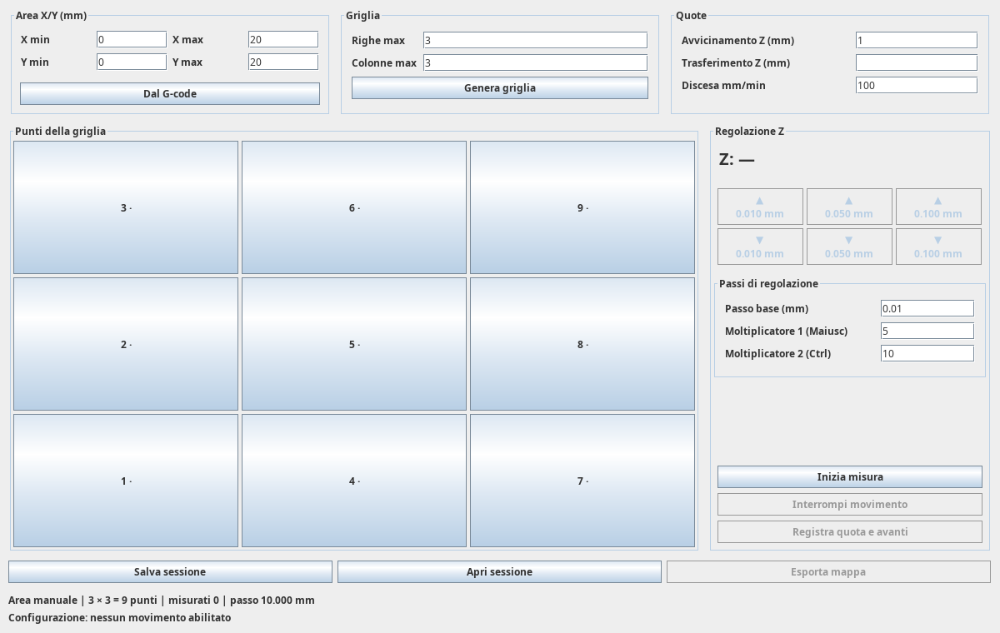

# UGS Manual Z Mapper

**Ready to install — no compilation required:** [Download the compiled plugin (.nbm)](https://github.com/FerX/ugs-manual-z-mapper/releases/download/v0.1.0/ugs-manual-z-mapper-0.1.0.nbm). Install it in UGS Platform via **Tools → Plugins → Downloaded → Add Plugins**.

Create a surface height map in **Universal Gcode Sender Platform without a probe**. Move to each grid point, adjust the tool height manually, confirm the work Z coordinate, and export an XYZ map for UGS AutoLeveler.

This is an independent NetBeans plugin. Installing it does not require rebuilding or modifying UGS.

> **N.B. — Vibe-coded project:** This project was developed with substantial AI-generated code and is experimental. Physical CNC validation is still pending. Use it at your own risk: incorrect commands, settings, or software defects can cause unexpected motion, machine or workpiece damage, or personal injury. Test in a simulator first, review clearances and settings before connecting a real machine, and keep the machine’s emergency stop accessible. The software is provided **without warranty**. To the extent permitted by applicable law, the authors and contributors accept no liability for damage, injury, or loss arising from its use. See the [GPL-3.0 license](LICENSE) for the full warranty and liability terms.



## Download and install

1. Download `ugs-manual-z-mapper-0.1.0.nbm` from the [Releases page](https://github.com/FerX/ugs-manual-z-mapper/releases).
2. In **UGS Platform**, select **Tools → Plugins → Downloaded → Add Plugins** and choose the `.nbm` file.
3. Complete installation and restart UGS when requested.
4. Open **Window → Plugins → Mappa Z manuale**.

Tested with **UGS Platform 2.1.26 on Linux x64**, using its bundled Java 17 runtime. Other UGS versions and operating systems have not been verified. The current plugin interface is in **Italian**; this README maps the main controls below.

## Workflow

Use the same work coordinate system and the same paper contact method for the main Z zero and every measured point. Keep the spindle stopped during measurement.

1. Load the machining G-code and establish the main work zero in UGS.
2. Click **Dal G-code** (area from G-code), then check the proposed X/Y bounds. Enter bounds manually if needed.
3. Set the maximum rows and columns, then click **Genera griglia** (generate grid). Start with a 3 × 3 grid. Initial Z values are zero, but points remain unmeasured until confirmed.
4. Set **Avvicinamento Z** (approach Z, initially +1 mm), **Trasferimento Z** (travel Z), and **Discesa mm/min** (descent feed). Approach and travel heights are absolute work Z coordinates; +1 mm is relative to work zero, not to an unknown local surface. Choose clearance suitable for the workpiece and fixtures.
5. Click **Inizia misura** (start measurement), then select a grid point. The plugin lifts Z, moves in XY, and descends to the approach height.
6. Once stationary, adjust Z using the six up/down buttons. Their default distances are ±0.01, ±0.05 and ±0.10 mm. Base step and multipliers are configurable. Buttons are enabled only during the adjustment stage.
7. Click **Registra quota e avanti** (record height and advance). Repeat for the remaining points.
8. **Salva sessione** saves a resumable session; **Apri sessione** loads it. **Esporta mappa** exports an XYZ file only when every point has been measured.
9. In UGS AutoLeveler, use **Open scan** to import the XYZ map. Verify millimetres and the reference-height settings before applying compensation.

Arrow keys are optional shortcuts when a grid point has keyboard focus: Up/Down use the base step, Shift multiplies it by 5 and Ctrl by 10 by default. **Interrompi movimento** requests a jog cancellation and suspends the session; it is not a substitute for the machine's emergency stop.

## Compatibility and current limits

- Maps and motion parameters use millimetres. The grid uses the spacing and point order expected by UGS AutoLeveler 2.1.26.
- Grid generation, session persistence, XYZ export, G-code bounds and motion sequencing have automated tests. AutoLeveler compatibility is checked against its actual classes. The real UGS backend has also been tested with grblHAL Simulator over a virtual serial port.
- Physical CNC validation is still pending. This first release is intended for evaluation and simulator testing before machine use.
- **UGS 2.1.26 limitation:** AutoLeveler may fail to import a map whose Z values are all identical. Its surface initialization requires a nonzero Z range. This plugin exports measured values unchanged and does not patch UGS.
- The Designer and Visualizer belong to UGS itself; this plugin does not modify either module.

## Build from source

Requirements: Git, a **Java 17 JDK** (including `javac`), and Internet access for Maven dependencies. No separate Maven installation is needed.

```bash
git clone https://github.com/FerX/ugs-manual-z-mapper.git
cd ugs-manual-z-mapper
./scripts/build.sh
```

The build script downloads the pinned UGS tag `v2.1.26` into the ignored `upstream/ugs` directory, builds the required dependencies, and runs the plugin tests. It does not change an installed UGS application.

Output: `target/nbm/ugs-manual-heightmap-0.1.0-SNAPSHOT.nbm`. The release download uses a friendlier filename; it contains the same module.

Detailed development documentation is currently in Italian under [docs](docs/README.md).

## License

[GNU GPL v3](LICENSE). This project is independent of the Universal Gcode Sender maintainers.
